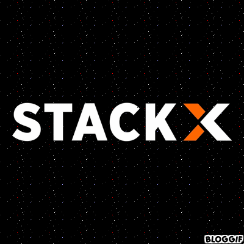

   
  <table align="center">
  <tr>
    <td>
      <b>
         <a href="README.md"><i>BR PORTUGUÊS</i></a>
      </b>
    </td>
    <td>
       <a href="readme-en.md"><i><b>US ENGLISH</i></a>
    </td>
  </tr>
</table>

 
 

  
   <h2> Estudante de Desenvolvimento  de Software na&ensp;

</h1>

◾ 🖥️ <I>Sou Pós-Graduada em História, com experiência em atuar como Professora e Coordenadora Pedagógica, do Ensino Público da Educação Básica, durante 7 anos.!!</I>

◾ 📚 <I>Atualmente estou em transição de carreira, onde tive o primeiro contato com a Programação em 2021, através de um curso para Desenvolvedor Full Stack,iniciando assim os estudos em JAVA, React, TypeScript, Node e JavaScript .Com isto o interesse em aprender Linguagem de Programação tornou-se cada vez maior e mais apaixonante, decidindo então investir nesta área que tanto me desafia e alavanca minha cognição. !!</I>

◾ 💡 <I>Atualmente estou focada em aprender Type Script, React, Angular e Java!!</I>

◾ 💡 <I>Estou disposta em me tornar uma Desenvolvedora, pretendendo adquirir competências, experiências, habilidades, conhecimentos , novas oportunidades e desafios, para viabilizar, expandir e concretizar minha carreira profissional,!!</I>

◾ 🥰 <I>Apresento-lhes aqui meu portfólio nas Linguagens ao qual estou me aprofundando!</I>
 
 
 
 ***
 
 
 
   
  

 

***

  
  
<table align="center" align="right" height="279px&theme=tokyonight&hidedark_border=true">
  <tr>
    <td align="center">
        
      
        <b>
          <pre>MySQL</pre>
        </b>
      
    </td>
    <td align="center">
        
      
        <b>
          <pre>Javascript</pre>
        </b>
      
    </td>
    <td align="center">
        
      
        <b>
          <pre>&ensp;CSS3&ensp;</pre>
        </b>
      
    </td>
        <td align="center">
        
      
        <b>
          <pre>HTML5</pre>
        </b>
      
    </td>
    <td align="center" width="100px;">
        
      
        <b>
          <pre>&emsp;Git&emsp;</pre>
        </b>
      
    </td>
    <td align="center">
        
      
        <b>
          <pre>ReactJS</pre>
        </b>
      
    </td>
    <td align="center">
        
      
        <b>
          <pre>PsotgreSQL</pre>
        </b>
      
    </td>
    <td align="center">
        
      
        <b>
          <pre>NodeJS</pre>
        </b>
      
    </td>
    <td align="center">
        
      
        <b>
          <pre>Bootstrap</pre>
        </b>
      
    </td>
    <td align="center">
        
      
        <b>
          <pre>JQuery</pre>
        </b>
      
    </td>
    <td align="center">
        
      
        <b>
          <pre>ViteJS</pre>
        </b>
      
    </td>
    <td align="center">
      
      
        <b>
          <pre>&ensp;CRA&ensp;</pre>
        </b>
      
    </td>
    <td align="center">
        
      
        <b>
          <pre>Typescript</pre>
        </b>
      
    </td>
    <td align="center">
        
      
        <b>
          <pre>Yarn/npm</pre>
        </b>
      
    </td>
    <td align="center">
        
      
        <b>
          <pre>&ensp;Axios&ensp;</pre>
        </b>
      
    </td>
    <td align="center">
        
      
        <b>
          <pre>Insomnia</pre>
        </b>
      
    </td>
    <td align="center">
        
      
        <b>
          <pre>VSCode</pre>
        </b>
      
    </td>
    <td align="center">
        
      
        <b>
          <pre>JAVA</pre>
        </b>
      
    </td>
     <td align="center">
        
      
        <b>
          <pre>SCSS</pre>
        </b>
      
    </td>                                                                           
    </td>
  </tr>
</table>                                                                                                                                                 
                       

<table height="496px">
    <tr>
    <td>
    
    </td>
  </tr>
  <tr>
    <td>
    
    </td>
  </tr>
  <tr>
    <td>
      
    </td>
  </tr>
  <tr>
    <td>
   
    </td>
  </tr>
  <tr>
    <td>
   
    </td>
  </tr>
  <tr>
    <td>
   
    </td>
  </tr>
  <tr>
    <td>
   
    </td>
  </tr>
  <tr>
    <td>
   
    </td>
  </tr>
  <tr>
    <td>
   
    </td>
  </tr>
  <tr>
    <td>
   
    </td>
  </tr>
</table>   
 
  
 
 ***

 
 
 <table align="center" align="right" height="279px" border: "border-width">
  <tr>
    <td align="center">
         
      
        <b>
          <pre>Linkedin</pre>
        </b>
      
    </td>
    <td align="center">
        
      
        <b>
          <pre>Instagram</pre>
        </b>
      
    </td>
    <td align="center">
       
      
        <b>
          <pre>Discord</pre>
        </b>
      
    </td>
        <td align="center">
          
      
        <b>
          <pre>WhatsApp</pre>
        </b>
      
    </td>
    <td align="center" width="100px;">
      </a>  
      
        <b>
          <pre>Facebook</pre>
        </b>
      
    </td>   
    <td align="center">
        
      
        <b>
          <pre>Yahoo</pre>
        </b>
      
    </td>
    <td align="center">
        
      
        <b>
          <pre>Telegram</pre>
        </b>
      
    </td>
    <td align="center">
        
      
        <b>
          <pre>Twitch.tv</pre>
        </b>
      
    </td>
    <td align="center">
        
      
        <b>
          <pre>Celular</pre>
        </b>
      
    </td>
     <td align="center">
        
      
        <b>
          <pre>&ensp;SMS&ensp;</pre>
        </b>
      
    </td>
    <td align="center">
       
      
        <b>
          <pre>Gmail</pre>
        </b>
      
    </td>
    </td>
  </tr>
</table>

  
  

  

 

  

      
     
 
 <!--
 🖥️ <I>Passionate about Technology!!</I>

◾ 📚 <I>Software Development Student at Editech StackX!!</I>

◾ 💡 <I>I'm currently focused on learning languages in Front End, Java AND SQL(Database!!</I>

◾ 🥰 <I>I present you here my portfolio in the Languages I'm delving into!</I>
  

https://www.fancytextconverter.com/

- use SVGs in a next big update.

-->

 

